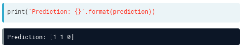
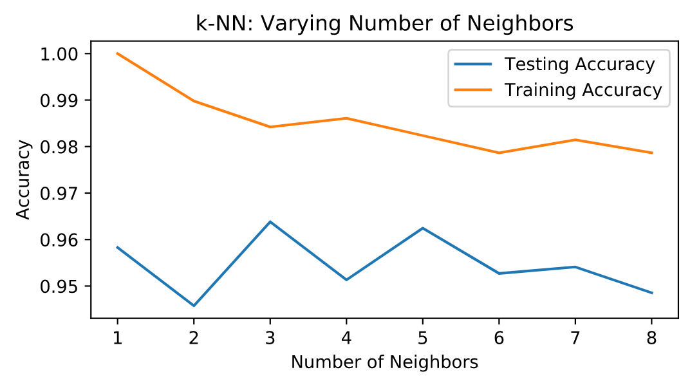

# APRENDIZAJE SUPERVISADO Y CLASIFICACION

### What is machine learning?

Es el arte y la ciencia de:
*   Darle a las computadoras la habilidad para aprender y tomar decisiones desde datos/informacion sin ser explicitamente programados

El **aprendizaje supervisado** es la rama en la que la computadora o el algoritmo clasifica por medio de etiquetas la informacion. Cuando no hay etiquetas se conoce como **Aprendizaje no supervisado** 

El aprendizaje no supervisado tiene como tarea el de descrubir patrones y estructuras ocultos a partir de datos sin etiquetar.

Existe otra rama llamada **Aprendizaje de refuerzo** en el que el software interactua con un entorno, este tipo de aprendizaje optimiza su comportamiento a partir de un sistema de recompensas y castigos, se inspira en la psciologia del comportamiento.

En el **lenguaje supervisado** los datos se representan en una estructura de una tabla 

  

El objetivo del lenguaje supervisado es construir un modelo que pueda predecir la variable objetivo. Si la predicción consta de separacion de productos entonces lo llamamos **Clasificacion** en el que la variable objetivo consta de categorias.

En otro caso, si la predicción es una variable continua, por ejemplo el precio de una casa, entonces se le llama **Regresion**.

En este caso nos enfocaremos en clasificacion,en un ambiente de lenguaje supervisado se ocupan ciertas palabras para referirnos a las variables: 
> Features = predictor variables = independient variables

ó
> Target variable = dependent variable = response variable

Uno de los principales objetivos del aprendizaje supervisado es el automatizar una tarea manual costosa o que lleva mucho tiempo ó para hacer predicciones sobre el futuro. Para poder trabajar con el aprendizaje supervisado necesitamos datos etiquetados.

Todos los modelos de machine learning son implementados en python como clases, de esta manera se implementan algoritmos para el aprendizaje y la prediccion, almacenando la informacion en forma de datos.

En los modelos de algoritmos utilizamos:
* el metodo **.fit()**: para entrenar el model con datos
* metodo **.precit()**: para predecir las etiquetas de la nueva informacion que no este etiquetada. 

#### Ejemplo
importamos el modelo KNeighboursClassifier que es uno de los modelos ya pre cargados.
> from sklearn.neighbors import KNeighborsClassifier

> knn = KNeighborsClassifier(n_neighbors=6)

ajustamos el clasificador a un conjunto de entrenamiento
> knn.fit(iris['data'], iris['target'])

En particular, cuando utilizamos **scikit-learn** requiere que las caracteristicas esten organizadas en una matriz, donde cada columna es una caracteristicas y cada fila es un punto de observacion o datos diferente.

  

y del mismo modo el objetivo debe ser una sola columna con el mismo numero de observaciones que los datos de la caracteristica

  

Ahora procedemos a predecir con datos que no tienen una etiqueta previa, es decir, informacion no etiquetada, tenemos un conjunto de datos **x_new** y utilizamos el metodo **.predict()** al que le pasamos los datos de x_new:

  

como lo mencionamos, la API requiere que los datos esten como una matriz numpy con caracteristicas en columnas y observaciones en filas, en el conjunto **x_new** observamos que contamos con tres observaciones y cuatro caracteristicas, entonces al llamar a **knn.predict()** de x_new esperariamos recibir una matriz de 3x1 con una prediccion para cada una de las observaciones 

  

en donde **1** corresponde a "versicolor" y **0** que corresponde a "setosa"

## EJEMPLO PARA CLASIFICAR

k-Nearest Neighbors: Fit

Having explored the Congressional voting records dataset, it is time now to build your first classifier. In this exercise, you will fit a k-Nearest Neighbors classifier to the voting dataset, which has once again been pre-loaded for you into a DataFrame df.

In the video, Hugo discussed the importance of ensuring your data adheres to the format required by the scikit-learn API. The features need to be in an array where each column is a feature and each row a different observation or data point - in this case, a Congressman's voting record. The target needs to be a single column with the same number of observations as the feature data. We have done this for you in this exercise. Notice we named the feature array X and response variable y: This is in accordance with the common scikit-learn practice.

Your job is to create an instance of a k-NN classifier with 6 neighbors (by specifying the n_neighbors parameter) and then fit it to the data. The data has been pre-loaded into a DataFrame called df.
* Import KNeighborsClassifier from sklearn.neighbors.
* Create arrays X and y for the features and the target variable. Here this has been done for you. Note the use of .drop() to drop the target variable 'party' from the feature array X as well as the use of the .values attribute to ensure X and y are NumPy arrays. Without using .values, X and y are a DataFrame and Series respectively; the scikit-learn API will accept them in this form also as long as they are of the right shape.
* Instantiate a KNeighborsClassifier called knn with 6 neighbors by specifying the n_neighbors parameter.
* Fit the classifier to the data using the .fit() method.
~~~
# Import KNeighborsClassifier from sklearn.neighbors
from sklearn.neighbors import KNeighborsClassifier

# Create arrays for the features and the response variable
y = df['party'].values
X = df.drop('party', axis=1).values

# Create a k-NN classifier with 6 neighbors
knn = KNeighborsClassifier(n_neighbors = 6)

# Fit the classifier to the data
knn.fit(X, y)
~~~

***
## EJEMPLO PARA PREDECIR, DATOS NO ETIQUETADOS
k-Nearest Neighbors: Predict

Having fit a k-NN classifier, you can now use it to predict the label of a new data point. However, there is no unlabeled data available since all of it was used to fit the model! You can still use the .predict() method on the X that was used to fit the model, but it is not a good indicator of the model's ability to generalize to new, unseen data.

In the next video, Hugo will discuss a solution to this problem. For now, a random unlabeled data point has been generated and is available to you as X_new. You will use your classifier to predict the label for this new data point, as well as on the training data X that the model has already seen. Using .predict() on X_new will generate 1 prediction, while using it on X will generate 435 predictions: 1 for each sample.

The DataFrame has been pre-loaded as df. This time, you will create the feature array X and target variable array y yourself.
* Create arrays for the features and the target variable from df. As a reminder, the target variable is 'party'.
* Instantiate a KNeighborsClassifier with 6 neighbors.
* Fit the classifier to the data.
* Predict the labels of the training data, X.
* Predict the label of the new data point X_new.

~~~
# Import KNeighborsClassifier from sklearn.neighbors
from sklearn.neighbors import KNeighborsClassifier 

# Create arrays for the features and the response variable
y = df['party'].values
X = df.drop('party', axis=1).values

# Create a k-NN classifier with 6 neighbors: knn
knn = KNeighborsClassifier(n_neighbors = 6)

# Fit the classifier to the data
knn.fit(X,y)

# Predict the labels for the training data X
y_pred = knn.predict(X)

# Predict and print the label for the new data point X_new
new_prediction = knn.predict(X_new)
print("Prediction: {}".format(new_prediction))

~~~

Ahora que sabemos como ajustar un clasificador y usarlo para predecir datos que no tiene una etiqueta, necesitamos **medir su rendimiento**, es decir, necesitamos una métrica.
En problemas de clasificacion, la métrica es una medida bastante común en la que **la metrica** se define como el numero de predicciones correctas divididas por el numero total de datos. Para poder obtener esta metrica y al dividirla, obtenemos dos sub conjuntos, un conjunto que es para entrenamiento y un conjunto que sirve para pruebas. La forma en la que se trabajan estos conjuntos es:
* Entrena o ajusta el clasificador en el conjunto de entrenamiento
* Realiza predicciones en el conjunto de pruebas etiquetado y compara las predicciones con las etiquetas ya conocidas
* Calcula la precision de sus predicciones

Para poder hacer lo anterior, necesitamos de
~~~
from sklearn.model_selection import train_test_split

# dividimos la prueba para obtener los datos aleatoriamente, el primer argumento serán los datos de la caracteristica y el segundo argumento los objetivos o las etiquetas

X_train, X_test, y_train, y_test = train_test_split(X,y,test_size=0.3, random_state=21, stratify=y)
~~~

La division de prueba de tren devuleve cuatro matrices: 
* los datos de entrenamiento
* los datos de prueba
* las etiquetas de entrenamiento y las etiquetas de prueba

las cuales se descomponen en:
* tren X
* prueba X
* tren y
* prueba y

Por defecto, la division de prueba se divide en 75% datos de entrenamiento y 25% datos de prueba, se puede modificar estos valores pero es lo mas conveniente, en el ejemplo anterior establecemos el tamaño de prueba en 0.3 o sea 30%. Para distribuir las etiquetas en los conjuntos de trenes y pruebas como estan en el conjunto original entonces ocupamos **stratify**  donde **y** es la lista o matriz que contiene las etiquetas.

Despues instanciamos nuestro clasificador de vecinos K mas cercano, lo ajustamos a los datos de entrenamiento. 
~~~
knn = KNeighborsClassifier(n_neighbors = 8)

#con el metodo fit, ajustamos nuestras predicciones sobre los datos de prueba y los almacenamos en y_pred

knn.fit(X_train, y_train)
y_pred = knn.predict(X_test)

#e imprimimos
print(\"Conjunto de predicciones:\\n{}\".format(y_pred))
~~~

  

**Para verificar la presicion de nuestro modelo** utilizamos el metodo **score** pasandole como argumento la prueba X_test, y_test
~~~
knn.score(X_test, y_test)
~~~

  

Dando una presicion del 95% lo cual es bastante bueno para poder usar el modelo

### EJEMPLO
~~~
# Import necessary modules
from sklearn import datasets
import matplotlib.pyplot as plt

# Load the digits dataset: digits
digits = datasets.load_digits()

# Print the keys and DESCR of the dataset
print(digits.keys())
print(digits.DESCR)

# Print the shape of the images and data keys
print(digits.images.shape)
print(digits.data.shape)

# Display digit 1010
plt.imshow(digits.images[1010], cmap=plt.cm.gray_r, interpolation='nearest')
plt.show()
~~~
obteniendo como respuesta: 

  

### EJEMPLO

* Import KNeighborsClassifier from sklearn.neighbors and train_test_split from sklearn.model_selection.
* Create an array for the features using digits.data and an array for the target using digits.target.
* Create stratified training and test sets using 0.2 for the size of the test set. Use a random state of 42. Stratify the split according to the labels so that they are distributed in the training and test sets as they are in the original dataset.
* Create a k-NN classifier with 7 neighbors and fit it to the training data.
* Compute and print the accuracy of the classifier's predictions using the .score() method.

~~~
# Import necessary modules
from sklearn.neighbors import KNeighborsClassifier
from sklearn.model_selection import train_test_split

# Create feature and target arrays
X = digits.data
y = digits.target

# Split into training and test set
X_train, X_test, y_train, y_test = train_test_split(X,y, test_size = 0.2, random_state=42, stratify=y)

# Create a k-NN classifier with 7 neighbors: knn
knn = KNeighborsClassifier(n_neighbors = 7)

# Fit the classifier to the training data
knn.fit(X_train,y_train)
# Print the accuracy
print(knn.score(X_test, y_test))

~~~
>Dando una precision de 0.9833333, osea un 98% el cual está muy bien.

### EXAMPLE Overfitting and underfitting

Remember the model complexity curve that Hugo showed in the video? You will now construct such a curve for the digits dataset! In this exercise, you will compute and plot the training and testing accuracy scores for a variety of different neighbor values. By observing how the accuracy scores differ for the training and testing sets with different values of k, you will develop your intuition for overfitting and underfitting.

The training and testing sets are available to you in the workspace as X_train, X_test, y_train, y_test. In addition, KNeighborsClassifier has been imported from sklearn.neighbors.

* Inside the for loop:
  * Setup a k-NN classifier with the number of neighbors equal to k.
  * Fit the classifier with k neighbors to the training data.
  * Compute accuracy scores the training set and test set separately using the .score() method and assign the results to the train_accuracy and test_accuracy arrays respectively.

~~~
# Setup arrays to store train and test accuracies
neighbors = np.arange(1, 9)
train_accuracy = np.empty(len(neighbors))
test_accuracy = np.empty(len(neighbors))

# Loop over different values of k
for i, k in enumerate(neighbors):
    # Setup a k-NN Classifier with k neighbors: knn
    knn = KNeighborsClassifier(n_neighbors=k)

    # Fit the classifier to the training data
    knn.fit(X_train, y_train)
    
    #Compute accuracy on the training set
    train_accuracy[i] = knn.score(X_train, y_train)

    #Compute accuracy on the testing set
    test_accuracy[i] = knn.score(X_test, y_test)

# Generate plot
plt.title('k-NN: Varying Number of Neighbors')
plt.plot(neighbors, test_accuracy, label = 'Testing Accuracy')
plt.plot(neighbors, train_accuracy, label = 'Training Accuracy')
plt.legend()
plt.xlabel('Number of Neighbors')
plt.ylabel('Accuracy')
plt.show()

~~~

Obteniendo una comparasion entre la presicion del testeo y del entreno en una grafica como:

  

