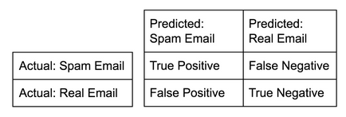

 una matriz de confusión es una herramienta que permite la visualización del desempeño de un algoritmo que se emplea en aprendizaje supervisado. Cada columna de la matriz representa el número de predicciones de cada clase, mientras que cada fila representa a las instancias en la clase real. Uno de los beneficios de las matrices de confusión es que facilitan ver si el sistema está confundiendo dos clases. 
 

  

A partir de la matriz de confusion, hay metricas que podemos obtener a partir de ésta, como 
* Precision: que es el numero de verdaderos positivos divido por el numero total de verdaderos positivos y falsos positivos. Tambien llamado valor predictivo o VPP

* Recall: que es el numero de verdaderos positivos divido por el numero total de verdaderos positivos y falsos negativos. Tambien es llamada sensibilidad, indice de aciertos o indice positivo verdadero

*Puntaje F1: es dos veces el producto de la precision y el recall divido por la suma de la precision y el recall, en otras palabras es la media armonica de precision y recuerdo